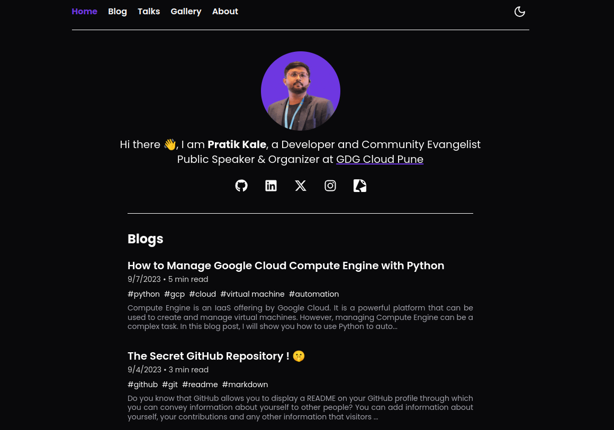

<h2 align="center">pratikkale.in</h2>



  <p align="center">
    My personal portfolio and blog <br>
     <a href="http://pratikkale.in"><strong>View Demo »</strong></a>
    </p>

## Built With


<a href="https://hashnode-next.vercel.app/"></a>

## Getting Started

```console
git clone https://github.com/pratikkalein/pratikkale.in.git
cd pratikkale.in
```

To set the correct version of PNPM, run nvm use from the root. There is a .nvmrc file that controls the correct node version.

```console
pnpm install
npm run dev
```

## Environment Variables

[.env.example](.env.example) contains all the environment variables you need to run a copy of hashnode-next for your headless blog. You can simply copy this file and rename it to `.env.local` to get started.

## License

Distributed under the MIT License. See the [license](LICENSE.md) for more information. <br>
Built using [hashnode-next.](https://hashnode-next.vercel.app/)
